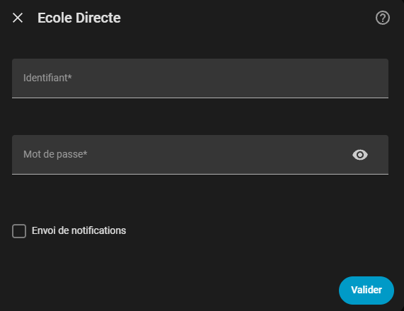
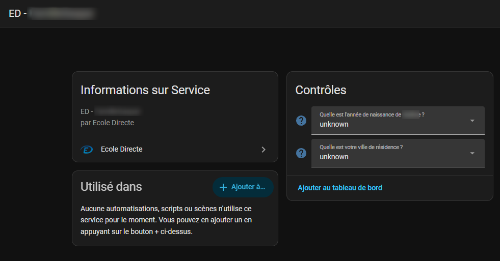
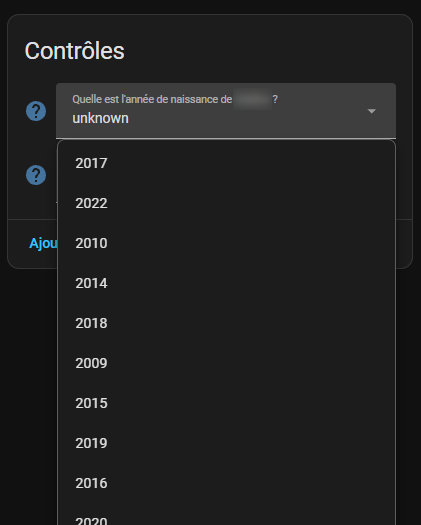
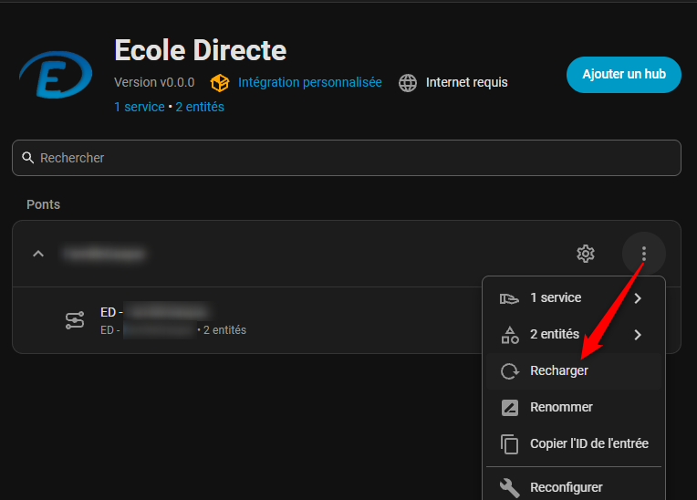
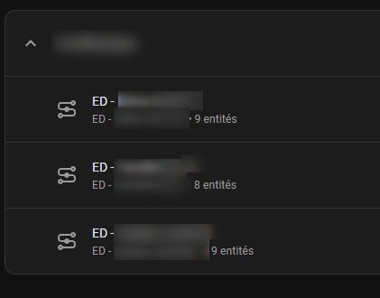
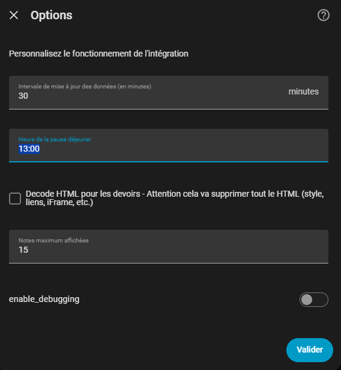

# Integration Ecole directe pour Home Assistant

[![GitHub Release][releases-shield]][releases]
[![GitHub Activity][commits-shield]][commits]
[![License][license-shield]](LICENSE)

[![hacs][hacsbadge]][hacs]
![Project Maintenance][maintenance-shield]

[![BuyMeCoffee][buymecoffeebadge]](https://www.buymeacoffee.com/giga77)

- [Installation](#Installation)
  - [Installation via l'interface utilisateur via HACS](#installation-via-linterface-utilisateur-via-hacs)
  - [Installation manuelle](<#installation-manuelle>)
- [Configuration](#Configuration)
- [Utilisation](#utilisation)

## 🚀 Installation

### Installation via l'interface utilisateur via HACS

1. Cliquez sur ce lien : [HACS: Ecole Directe](https://my.home-assistant.io/redirect/hacs_repository/?owner=hacf-fr&repository=hass-ecoledirecte)
2. Cliquez sur le bouton `Open link`.
3. Cliquez sur le bouton `Télécharger` en bas à droite, puis une deuxième fois sur `Télécharger`.
4. Il faut ensuite redémarrer Home Assistant.

### Installation manuelle

Copier le répertoire ecole_directe de la dernière release dans le répertoire custom_components de votre répertoire config. Redémarrer Home Assistant

## ✨ Configuration

Cliquer sur ce bouton:
[](https://my.home-assistant.io/redirect/config_flow_start/?domain=ecole_directe)

Ou aller dans :
Paramètres > Appareils et services > Intégrations > Ajouter une intégration, et chercher "Ecole Directe"

Utiliser votre identifiant et mot de passe :



L'option "Envoi de notifications" permet d'envoyer une notification lorsqu'il y a une nouvelle question pour la double autentification. Il est aussi possible de créer une automatisation à partir de l'événement "ecole_directe_event" de type "new_qcm".
Exemple:

```yaml
alias: Ecole Directe - notification nouvelle question QCM
description: Notification en cas de nouvelle question QCM dans le fichier qcm
trigger:
  - platform: event
    event_type: ecole_directe_event
    event_data:
      type: new_qcm
action:
  - service: notify.persistent_notification
    data:
      message: >
        Nouvelle question : {{ trigger.event.data.question }} Il faut vérifier
        le fichier qcm
      title: Nouvelle question qcm Ecole Directe
mode: queued
max: 10
```

### Double autentification

Avant la version v1.2.2, la double autentification était gérée via un fichier qcm au format json. Certain utilisateurs ayant des difficultés à le gérer, les question sont maintenant représentées dans des entités.
Lors de la première connection, il y a un seul service avec deux questions:


Il faut choisir les bonnes réponses:



Il faudra ensuite recharger l'intégration et à nouveau répondre.



Il est possible de devoir recharger plusieurs fois l'intégration.
Une fois connecté à Ecole Directe, les noms élèves apparaissent avec leurs entités respectives:



### Après la configuration (Options)

Vous pouvez changer ces options à tout moment en cliquant sur la roue crantée **Configurer**:


Nom | Valeur par défaut
--- | -----------------
Intervale de mise à jour des données (en minutes) | 30 minutes
Heure de la pause déjeuner | 13:00
Decode HTML pour les devoirs | false
Notes maximum affichées | 15
Enable Debugging | Off

## Utilisation

Cette intégration fournit plusieurs entités, toujours préfixées avec `ed_PRENOM_NOM` (où `PRENOM` et `NOM` sont remplacé).
Les entités sont mises à jour toutes les 30 minutes.
Dans vos dashboards, vous pouvez utiliser les cartes incluses dans cette intégration [EcoleDirecteHACards](https://github.com/hacf-fr/hass-ecoledirecte/tree/main/src/cards).

Entité | Description
------ | -----------
`sensor.ed_PRENOM_NOM` | informations basique de l'enfant
`[...]_devoirs` | devoirs
`[...]_devoirs_aujourd_hui` | devoirs du jour
`[...]_devoirs_demain` | devoirs du lendemain
`[...]_devoirs_jour_suivant` | devoirs du jour ouvré suivant (ex: si on consulte le vendredi, il doit y avoir les devoirs du lundi )
`[...]_devoirs_semaine_en_cours` | devoirs de la semaine en cours
`[...]_devoirs_semaine_suivante` | devoirs de la semaine suivante
`[...]_devoirs_semaine_apres_suivante` | devoirs de la semaine suivante suivante :D
`[...]_notes` | notes
`[...]_evaluations` | evaluations
`[...]_emploi_du_temps_aujourd_hui` | emploi du temps du jour
`[...]_emploi_du_temps_demain` | emploi du temps du lendemain
`[...]_emploi_du_temps_jour_suivant` | emploi du temps du jour ouvré suivant (ex: si on consulte le vendredi, il doit y avoir l'emploi du temps du lundi )
`[...]_emploi_du_temps_semaine_en_cours` | emploi du temps de la semaine en cours
`[...]_emploi_du_temps_semaine_suivante` | emploi du temps de la semaine suivante
`[...]_emploi_du_temps_semaine_apres_suivante` | emploi du temps de la semaine suivante suivante :D
`[...]_absences` | absences
`[...]_retards` | retards
`[...]_sanctions` | sanctions
`[...]_encouragements` | encouragements

Il y a des événements qui sont déclenché sous certaines conditions. Ils peuvent être utiliser comme déclencheur dans des automatisations.

Evénement | Description
--------- | -----------
`new_formulaire` | nouveau formulaire
`new_devoir` | nouveau devoir
`new_note` | nouvelle note
`new_evaluation` | nouvelle evaluation
`new_absence` | nouvelle absence
`new_retard` | nouveau retard
`new_sanction` | nouvelle sanction
`new_encouragement` | nouvel encouragement
`new_qcm` | nouveau qcm

## Activer les logs de debug

Pour activer le mode debug de cette intégration, ajoutez le yaml suivant dans le fichier `configuration.yaml` et redémarrer Home Assistant :

```yaml
logger:
  default: info
  logs:
    custom_components.ecole_directe: debug
    ecoledirecte_api: debug
```

## 🤝 Contributions

Les contributions sont les bienvenues!

---

## 🤖 Développement assisté par IA

> **ℹ️ Avis de transparence**
>
> Cette intégration a parfois été développée avec l'aide d'agents de codage IA (GitHub Copilot, Claude et autres). Bien que le code respecte les normes Home Assistant Core, le code généré par IA peut ne pas avoir été révisé ou testé dans la même mesure qu'un code écrit manuellement.
>
> Les outils d'IA ont été utilisés pour :
>
> - Générer du code générique respectant les modèles Home Assistant
> - Implémenter des fonctionnalités d'intégration standard (flux de configuration, coordinateur, entités)
> - Assurer la qualité du code et la sécurité du typage
> - Rédiger la documentation et les commentaires
>
> Veuillez noter que le développement assisté par IA peut entraîner des comportements inattendus ou des cas particuliers qui n'ont pas été minutieusement testés. Si vous rencontrez des problèmes, veuillez [ouvrir un problème](../../issues) sur GitHub.
>

---

## 📄 Licence

Ce projet est sous licence MIT - voir le fichier [LICENSE](LICENSE) pour plus de détails.

---

**Fait avec ❤️ par [@Giga77][user_profile]**

---

[commits-shield]: https://img.shields.io/github/commit-activity/y/hacf-fr/hass-ecoledirecte.svg?style=for-the-badge
[commits]: https://github.com/hacf-fr/hass-ecoledirecte/commits/main
[hacs]: https://github.com/hacs/integration
[hacsbadge]: https://img.shields.io/badge/HACS-Default-orange.svg?style=for-the-badge
[license-shield]: https://img.shields.io/github/license/hacf-fr/hass-ecoledirecte.svg?style=for-the-badge
[maintenance-shield]: https://img.shields.io/badge/maintainer-%40Giga77-blue.svg?style=for-the-badge
[releases-shield]: https://img.shields.io/github/release/hacf-fr/hass-ecoledirecte.svg?style=for-the-badge
[releases]: https://github.com/hacf-fr/hass-ecoledirecte/releases
[user_profile]: https://github.com/Giga77

[buymecoffeebadge]: https://img.shields.io/badge/buy%20me%20a%20coffee-donate-yellow.svg?style=for-the-badge
